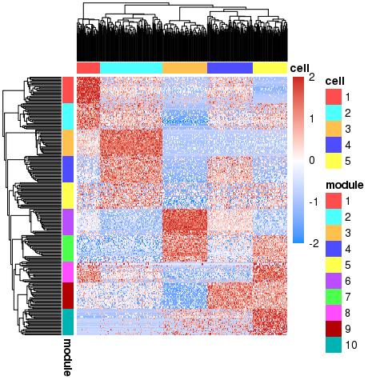
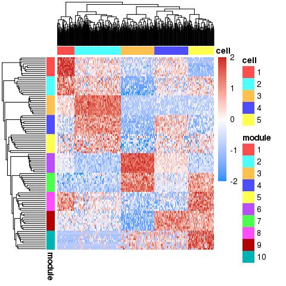
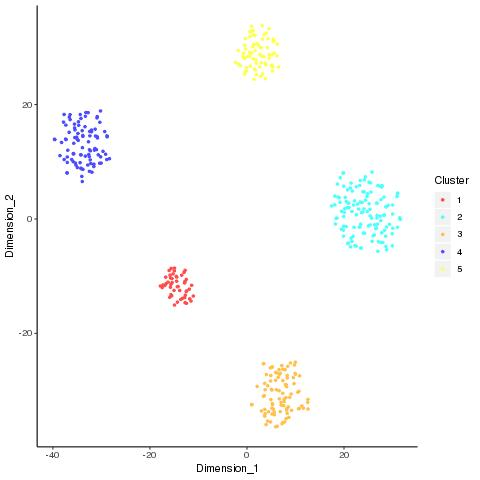
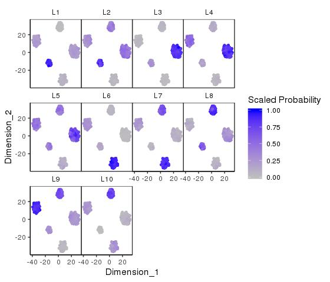
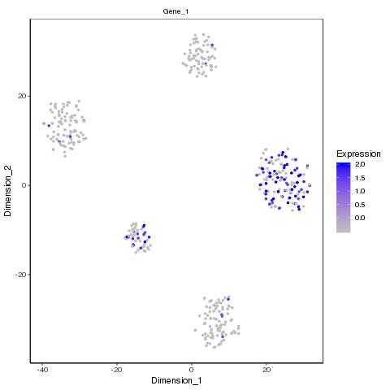
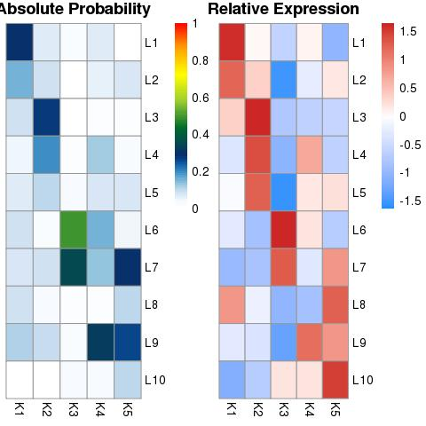
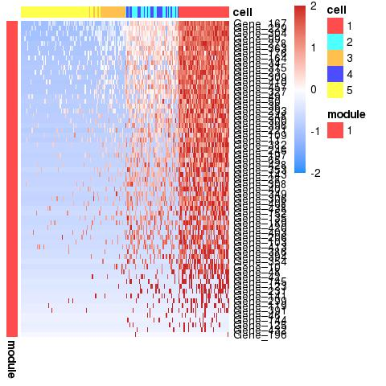
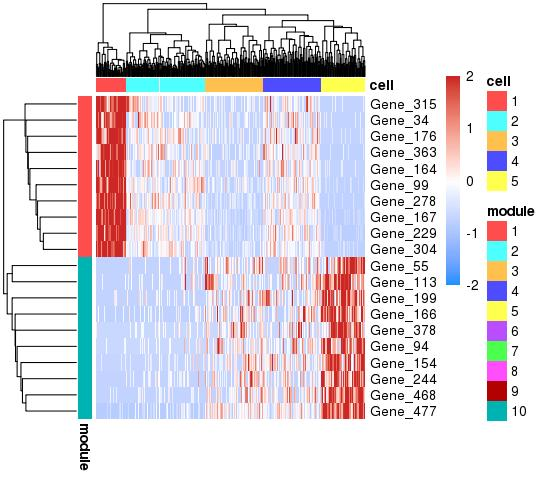
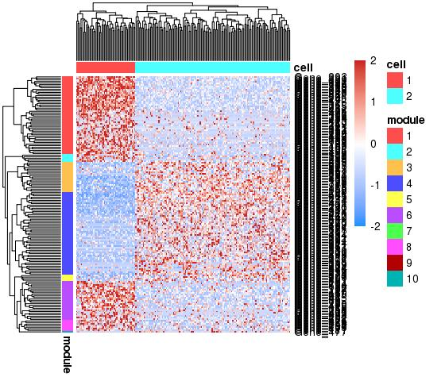
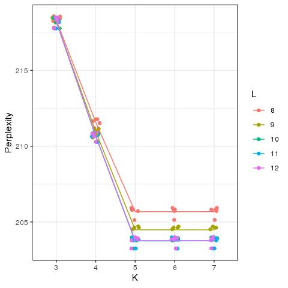

  
# Introduction
  
  "Celda" stands for "**CE**llular **L**atent **D**irichlet **A**llocation", which is a suite of Bayesian hierarchical models and supporting functions to perform feature and cell clustering for count data generated by single-cell RNA-seq platforms. This algorithm is an extension of the Latent Dirichlet Allocation (LDA) topic modeling framework that has been popular in text mining applications. Celda has advantages over other clustering frameworks:
  
1) Celda can simultaneously cluster cells into cell subpopulations and features such as gene expression into feature modules - subgroups of features that are likely to be expressed in similar proportions -  over different types of cells
2) Celda uses count-based Dirichlet-multinomial distributions so no additional normalization is required for DGE single-cell RNA-seq
3) These types of models have shown good performance with sparse data.

In this vignette we will demonstrate how to perform cell and feature clustering with simulated and real single-cell RNA-seq data using the Bayesian hierarchical models within Celda. 


# Installation Instructions

Currently Celda is hosted on a Github repository `compbiomed/celda`.

```{r,eval=FALSE}
library(devtools)
source("https://bioconductor.org/biocLite.R")
install.packages("Rcpp")
biocLite("SummarizedExperiment")
biocLite("MAST")
install_github("compbiomed/celda")
```

This should automatically install Celda on your local machine as long as you have proper internet connection.  If you have any errors in the installation or running of Celda, please post them to the Celda Github repository at https://github.com/compbiomed/celda/issues. If you have any other questions or comments, contact us on the Celda Google Group at https://groups.google.com/forum/#!forum/celda-list. 

Once installed the package can be loaded using the `library` command.

```{r,eval=FALSE}
library(celda)
```

Complete list of help files are accessible using the help command with a `package` option.

```{r,eval=FALSE}
help(package=celda)
```

<br>

# Single-cell RNA-seq dataset analysis with Celda

Celda will take a matrix of counts where each row is a feature and each cell is a column and each entry in the matrix is the number of counts for each feature in each cell. We will start with a simple matrix of counts that were simulated according to the generative process underlying the celda_CG model.

```{r,eval=T, warning = FALSE, echo = FALSE, message = FALSE}
library(devtools)
library(celda)
library(Matrix)
library(gtools)
library(ggplot2)
library(Rtsne)
library(reshape2)
```

We use the built-in data generating function `simulateCells` to simulate a single-cell RNA-Seq dataset. In the function `simulateCells`, the K parameter designates the number of cell clusters, the L parameter determines the number of feature modules, the S parameter determines the number of samples in the simulated dataset, and the G parameter determines the number of features to be simulated.

```{r}
getwd()
sim_counts <- simulateCells("celda_CG", K = 5, L = 10, S = 5, G = 500)
```

The `counts` variable contains the counts matrix.
The dimensions of counts matrix:

```{r}
dim(sim_counts$counts)
```

The `z` variable contains the cluster labels for each cell.
Here is the number of cells in each subpopulation:

```{r}
table(sim_counts$z)
```

The `y` variable contains the feature module assignment for each feature. 
Here is the number of features in each feature module:

```{r}
table(sim_counts$y)
```

The `sample.label` is used to denote the sample from which each cell was derived. In this simulated dataset, we have 10 samples:

```{r}
table(sim_counts$sample.label)
```

## Running the Celda function

There are currently three models within this package: `celda_C` will cluster cells, `celda_G` will cluster features, and `celda_CG` will simultaneously cluster cells and features. Within the function the K parameter will be the number of cell populations to be estimated, while the L parameter will be the number of feature modules to be estimated in the output model.

```{r, warning = FALSE, message = FALSE}
celda.model <- celda_CG(counts = sim_counts$counts, K = 5, L = 10, verbose = FALSE)
```

Here is a comparison between the true cluster labels and the estimated cluster labels, which can be found within the `z` and `y` objects.

```{r}
table(celda.model$z, sim_counts$z)
table(celda.model$y, sim_counts$y)

```

We can display the clustering results with a heatmap of the normalized counts, obtained by the function `celdaHeatmap`.

```{r, eval=FALSE, fig.width = 8, fig.height = 8, warning = FALSE, message = FALSE}
celdaHeatmap(counts = sim_counts$counts, celda.mod = celda.model)
```


## Matrix factorization

Celda can also perform matrix factorization to summarize the contribution of each feature to feature module, cell to feature module, and feature module to each cellular subpopulation. Matrix factorization decomposes the counts matrix into multiple matrices, using the given Celda model. Each of these following matrices can be viewed as raw counts values, proportional values, or posterior probability values.

```{r}
factorized <- factorizeMatrix(counts = sim_counts$counts, celda.mod = celda.model)
names(factorized)
```

The `module` object contains each feature's contribution to the feature module it belongs. For our example, the matrix contains `r nrow(factorized$proportions$module)` genes to 10 feature modules.

```{r}
dim(factorized$proportions$module)
head(factorized$proportions$module)
```

The `cell` object contains each feature module's contribution to each cell subpopulation. Here, there are 10 feature modules to `r ncol(factorized$proportions$cell)` cells.

```{r}
dim(factorized$proportions$cell)
factorized$proportions$cell[,1:3]
```

The `cell.population` contains each feature module's contribution to each of the cell states. Since K and L were set to be 5 and 10, there are 5 cell subpopulations to 10 feature modules.

```{r}
cell.pop <- factorized$proportions$cell.population
dim(cell.pop)
cell.pop
```

The top features in a feature module can be selected using the `topRank` function on the `module` matrix:

```{r}
top.genes <- topRank(matrix = factorized$proportions$module, n = 50, threshold = NULL)
```

```{r}
top.genes$names$L1
```

We can also make a heatmap of these top genes by using the using the `nfeatures` parameter:

```{r, eval = FALSE, fig.width = 8, fig.height = 8}
top.genes.ix <- unique(unlist(top.genes$index))
celdaHeatmap(counts = sim_counts$counts, celda.mod = celda.model, nfeatures = 10)
```



## Visualization of the Celda model

### celdaTsne + dimensionality reduction plotting tools

Celda contains its own tSNE function, `celdaTsne`, in which the output can be plotted by the `plotDimReduceCluster`, `plotDimReduceModule`, and `plotDimReduceFeature` functions. These will plot the tSNE results, which the cells will be labeled by its Celda cluster labels, its module probabilities, and its expression of a specific feature respectively:

```{r}
tsne <- celdaTsne(counts = sim_counts$counts, celda.mod = celda.model)
```

```{r, eval = FALSE}
plotDimReduceCluster(dim1 = tsne[,1], 
                     dim2 = tsne[,2], 
                     cluster = celda.model$z)

plotDimReduceModule(dim1 = tsne[,1], dim2 = tsne[,2], 
                   celda.mod = celda.model, counts = sim_counts$counts, rescale = TRUE)

plotDimReduceFeature(dim1 = tsne[,1], dim2 = tsne[,2],
                     counts = sim_counts$counts, features = "Gene_1")
```





### celdaProbabilityMap

In addition to the aforementioned factorized counts matrix, the feature modules and cell states of a Celda model can also be visualized with `celdaProbabilityMap`, which may be useful in determining which cell states highly express a particular feature module. The heatmap of the absolute probability of each feature module in each cellular subpopulation is shown on the left, while on the right, the z-score of the square root of the absolute probability is taken to create a relative probability heatmap.

```{r, eval = FALSE, fig.width = 8, fig.height = 8}
celdaProbabilityMap(counts = sim_counts$counts, celda.mod = celda.model)
```


### moduleHeatmap

`moduleHeatmap` creates a heatmap using only the features from a specific cell population and/or feature module, which is specified in the `feature.module` parameter. This enables he visualization of co-expression patterns of features within the feature module.

```{r, eval = FALSE, fig.width = 8, fig.height = 8}
moduleHeatmap(counts = sim_counts$counts, celda.mod = celda.model, feature.module = 1:2)
```


In addition to `celdaHeatmap`, Celda contains the `plotHeatmap` function, which allows for more user customization. For instance, if users want to plot a specific feature, users can utilize the `feature.ix` parameter. Unlike `celdaHeatmap`, `plotHeatmap` does not internally normalize the counts matrix. The normalization can be done via the `normalizeCounts` function.

```{r}
genes = c("Gene_1","Gene_2","Gene_3")
gene.ix = which(rownames(sim_counts$counts) %in% genes)
norm.counts <- normalizeCounts(counts = sim_counts$counts, scale.fun = scale)
```

```{r, eval = FALSE, fig.width = 8, fig.height = 8}
plotHeatmap(counts = norm.counts, z = celda.model$z, y = celda.model$y, feature.ix = gene.ix, show.names.feature = TRUE)
```


## Differential Expression Analysis

Celda employs the `MAST` package [(McDavid A, 2018)](https://bioconductor.org/packages/release/bioc/html/MAST.html) for differential expression analysis of single-cell data. The `differentialExpression` function determines features that are differentially expressed in one cell subpopulation against all other subpopulations, or between two cell subpopulations, which may be useful when trying to differentiate between two subpopulations with similar expression patterns.

If you wish to compare one cell subpopulation compared to all others, leave c2 as NULL: 

```{r,message=FALSE}
diff.exp.clust1 <- differentialExpression(counts = sim_counts$counts, 
                                            celda.mod = celda.model, 
                                            c1 = 1, c2 = NULL)

head(diff.exp.clust1,10)
```

If you wish to compare two cell subpopulations, use both c1 and c2 parameters.

```{r, message=FALSE}
diff.exp.clust1vs2 <- differentialExpression(counts = sim_counts$counts, celda.mod = celda.model, c1 = 1, c2 = 2)

diff.exp.clust1vs2 <- diff.exp.clust1vs2[diff.exp.clust1vs2$fdr < 0.25,]
```

The top upregulated genes in the first cluster:

```{r}
upreg.genes <- head(diff.exp.clust1vs2[order(diff.exp.clust1vs2$log2fc, decreasing = TRUE),],10)
```

These genes can be visualized further via heatmaps and tSNE:

```{r}
upreg.gene.ix = which(rownames(sim_counts$counts) %in% upreg.genes$Gene)

norm.counts <- normalizeCounts(counts = sim_counts$counts, scale.fun = scale)
```

```{r, eval = FALSE}
plotHeatmap(counts = norm.counts, z = celda.model$z, y = celda.model$y, feature.ix = upreg.gene.ix, show.names.feature = TRUE)
```


```{r, eval = FALSE, fig.height = 8, fig.width = 8}
plotDimReduceFeature(dim1 = tsne[,1], dim2 = tsne[,2], counts = sim_counts$counts, features = upreg.genes$Gene[1:9])
```


## Identifying the optimal number of cell subpopulations and feature modules

In the previous example, the Celda model was run specifically on the K and L values that the simulated data was generated from. However, the optimal number of K and L of a dataset will likely not be known a priori. Therefore, multiple choices of K and L may need to tested and compared. Additionally, Celda is sensitive to initial start conditions, so it is good practice to run multiple chains for each combination of K and L to increase the chances of finding the most optimal solution. Celda is able to run multiple combinations of K and L with multiple chains for each combination in parallel via the `celdaGridSearch` function. 

```{r, eval = FALSE, message = FALSE}
cgs <- celdaGridSearch(sim_counts$counts,
                            params.test = list(K = 3:7, L = 8:12),
                            cores = 1,
                            model = "celda_CG",
                            nchains = 2,
                            max.iter = 100,
                            best.only = TRUE)
```

`resamplePerplexity` calculates the perplexity of each model's cluster assignments, as well as resamplings of that count matrix. The result of this function can be visualized with `plotGridSearchPerplexity` for determination of the optimal K/L values.

```{r, eval = FALSE}
cgs <- resamplePerplexity(counts = sim_counts$counts,
                                     celda.list = cgs,
                                     resample = 5)
```

```{r, eval = FALSE, fig.width = 8, fig.height = 8, warning = FALSE, message = FALSE}
plotGridSearchPerplexity(celda.list = cgs)
```


`plotGridSearchPerplexity` plots K and L values of a model generated by `celdaGridSearch` against the final perplexity of the model output, in which users can determine the optimal K/L values where there is an elbow in the plot. In the above plot, the perplexity decreases from K = 3 to 5, but stays roughly the same from K = 5 to K = 7. At K = 5, there is a drop in perplexity from L = 8 to L = 10, but stays the same from L = 10 to L = 12. Thus, it seems that K = 5, L = 10 would be the optimal parameters.


Once users have chosen the K/L parameters for further analysis, the `subsetCeldaList` function can be used to subset the celda_list object to a single model.

```{r, eval = FALSE}
celda.model = subsetCeldaList(celda.list = cgs, params = list(K = 5, L = 10))
```

If the best.only parameter used in the `celdaGridSearch`, users can use the `selectBestModel` function to select a Celda model with the lowest log-likelihood. Alternatively, users can use select a chain of their choice by specifying the index within the `subsetCeldaList` function.

```{r, message=FALSE, eval=FALSE}
cgs <- celdaGridSearch(sim_counts$counts,
                            params.test = list(K = 3:7, L = 8:12),
                            cores = 1,
                            model = "celda_CG",
                            nchains = 2,
                            max.iter = 100,
                            best.only = FALSE)

cgs <- resamplePerplexity(counts = sim_counts$counts,
                                     celda.list = cgs,
                                     resample = 2)

celda.model.list = subsetCeldaList(celda.list = cgs, params = list(K = 5, L = 10))

celda.model1 <- selectBestModel(celda.list = celda.model.list)

celda.model2 <- subsetCeldaList(celda.list = cgs, params = list(K = 5, L = 10, chain = 2))
```

## Miscellaneous utility functions

Celda also contains several utility functions for the users' convenience.

`featureModuleLookup` can be used to look up the module a specific feature was clustered to. 

```{r}
featureModuleLookup(counts = sim_counts$counts, celda.mod = celda.model, 
                          feature = c("Gene_99"))
```

`recodeClusterY` and `recodeClusterZ` allows the user to recode the feature and cell cluster labels, respectively. 

```{r}
celda.model.y.recoded <- recodeClusterY(celda.mod = celda.model, from = c(1,2,3,4,5), to = c(2,1,3,4,5))

celda.model.z.recoded <- recodeClusterZ(celda.mod = celda.model, from = c(1,2,3,4,5), to = c(2,1,3,4,5))
```

The model prior to reordering:

```{r}
table(celda.model$z)
table(celda.model$y)
```

Upon recoding z, and y labels:

```{r}
table(celda.model.z.recoded$z)
table(celda.model.y.recoded$y)
```

